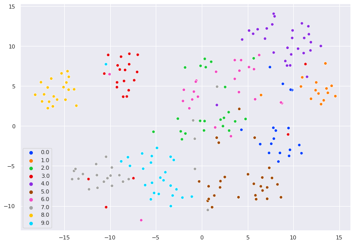
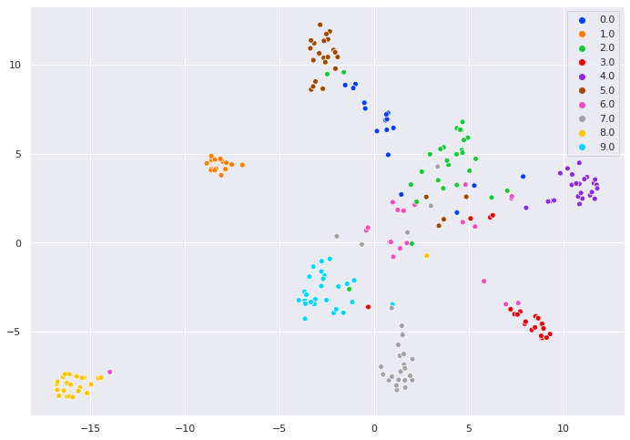
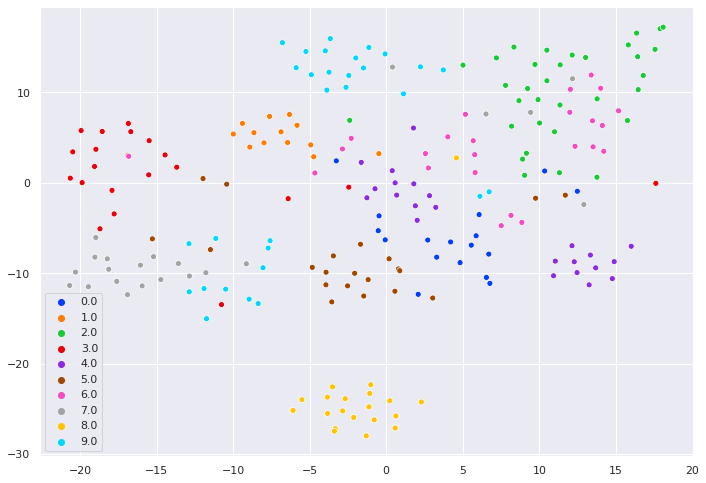

# Genre Classification With Deep Learning

Deep learning based music genre classification.

Audio spectograms are processed as images and a pre-trained ResNet CNN classifier is fine-tuned for classification.

Classifier is trained with softmax-cross-entropy, center-softmax, cos-face and sphere-face losses (popular losses for face recognition networks) and corresponding embeddings are visualized.


## Usage

1.  ```git clone https://github.com/tusharsircar95/GenreClassification```

2. Download the dataset.
   ```
   bash wget http://opihi.cs.uvic.ca/sound/genres.tar.gz
   tar -xvzf genres.tar.gz
   ```

3. Train the network. 

   ```
   usage: train.py [-h] [--data_root DATA_ROOT] --preloaded PRELOADED [--n_epochs N_EPOCHS] [--batch_size BATCH_SIZE]
                --embedding_type EMBEDDING_TYPE [--embedding_save_path EMBEDDING_SAVE_PATH]
   ```
   
   
   <b>data_root:</b> Folder path to the dataset of songs (audio clips)
   
   <b>preloaded:</b> 0 (load songs and generate spectograms) or 1 (use pre-loaded spectograms from the current directory)
   
   <b>n_epochs:</b> Number of epochs to train the network
   
   <b>batch_size:</b> Batch size for training
   
   <b>embedding_type:</b> Classification loss for training. Presently supports ['softmax', 'center-softmax', 'sphere', 'cos']
   
   <b>embedding_save_path:</b> Folder path to store embeddings generated by the network
   
   
   If the dataset hasn't been processed yet:
   ``` 
   %run 'train.py' --preloaded 0 --data_root './genres' --embedding_type 'center-softmax' --embedding_save_path './embedding'
   
   ```
   
   If the .npy files have already been generated:
   ```
   %run 'train.py' --preloaded 1 --data_root './genres' --embedding_type 'center-softmax' --embedding_save_path './embedding'
   
   ```
   
## Results

Accuracy:
<ul>
   <li> Softmax Loss: 76.39%</li>
   <li> Center-Softmax Loss: 85.39%</li>
   <li> Cosine Loss: 79.79%</li>
</ul>

Embeddings:
<table align='center'>
  <tr align='center'>
    <td width='100px'> Softmax </td>
    <td width='100px'> Center-Softmax </td>
    <td width='100px'> Cos </td>
  </tr>
  <tr>
    <td></td>
    <td></td>
     <td></td>
  </tr>
  
</table>
